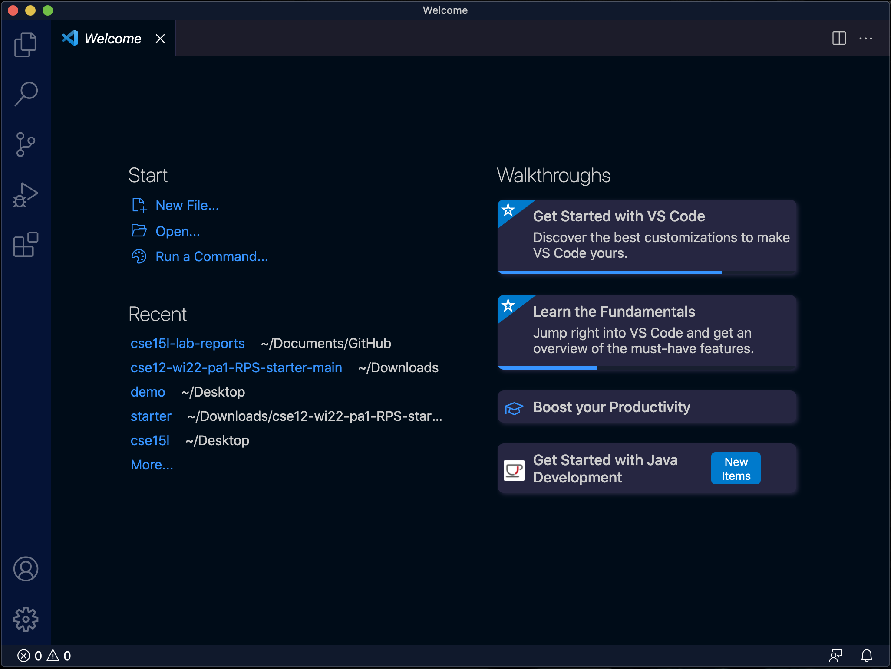
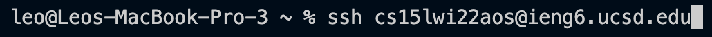
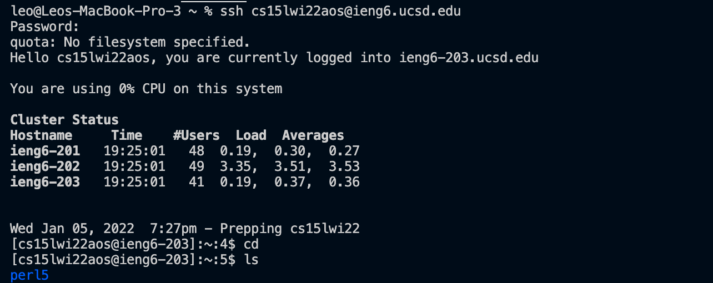
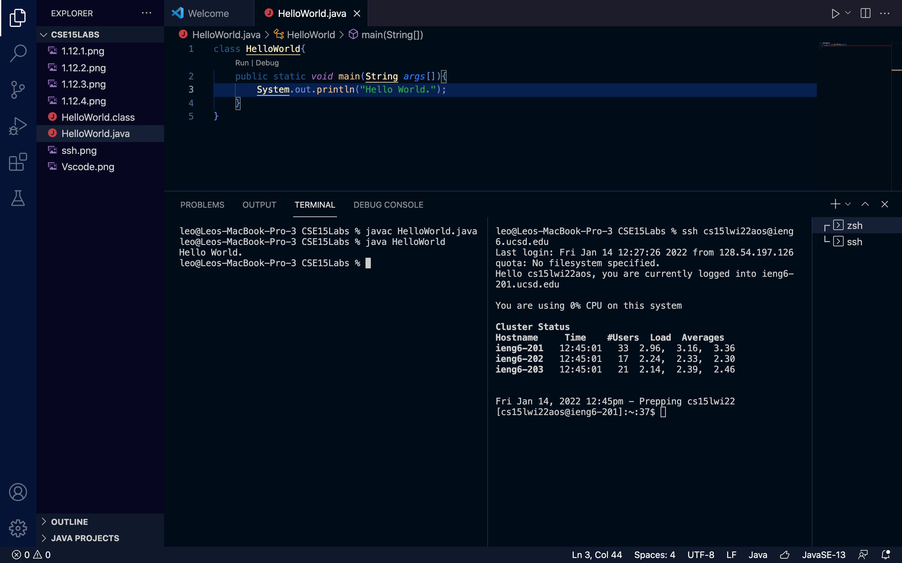
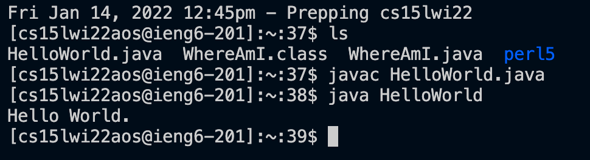
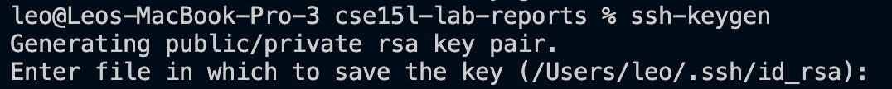
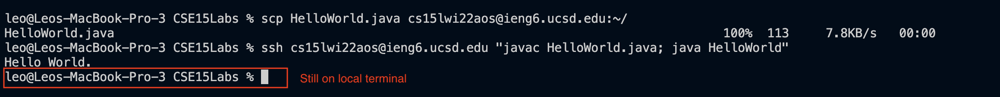

# CSE15L Lab Report 1

**Welcome to my tutorial of how to setup vscode, remotely connecting your very own course-specific account, and running commands locally and remotely as a cse15l student.
Follow the steps below carefully:**

## 1. Obtaining VSCode
 For starters, we need to download and install
 [Visiual Studio Code](https://code.visualstudio.com/) (click here to download). Install the correct version according to your operating system (i.e. macOS, windows, etc).

 After you have finished downloading and opening VSCode, you will see something like this (mac):
 

 You should now be able to open up a terminal by selecting Terminal > New Terminal, or press **control+shift+`**.

 Note: before continuing to the next step, if you are on windows operating system, make sure to download [OpenSSH](https://docs.microsoft.com/en-us/windows-server/administration/openssh/openssh_install_firstuse) first.

## 2. Connecting to your account
 To connect to your personal course specific-account, you must first lookup your username [here](https://sdacs.ucsd.edu/~icc/index.php).

 Once you have entered your credentials, you can find an account name in the form:
 
 **cs15lwi22xxx**

 Where the "wi22" stands for winter of 2022, and "xxx" a personal three digit number/letters as your account name.

 Now type in the following command in your terminal:
 ```
 ssh cs15lssyyxxx@ieng6.ucsd.edu
 ```
 Where ssyy stands for the season and year of your current cse15l course, and xxx your account name just like the following screenshot:
 

 Right here wi22 is my current course season and year, and aos is my account name.
 After you hit enter, you may see the following line:
 ```
 password:
 ```
 Simply enter your UCSD tritonlink password and you should be connected to the server.

Note: the first time you connect to the server you may see a message where it says the authenticity of the host can't be established. Now type 'yes' into the console and you will be able to establish connection to the server.

If you are still unable to connect to the server, please reachout to a TA or instructor for help.

## 3. Some commands to try
Once you are connected to the server, you may now try several commands:
```
$ cd
$ ls
$ pwd
```
cd - stands for change directory, use this to enter different folders on your laptop or on the server.

ls - stands for list, lists all directories or folders in your current directory.

pwd - stands for print working directory, lists your current working folder's path.


Once you have entered a few commands, you may notice that there is a number on the left that increments by one each time you run a command. This is the numbers of command you ran in total in the server.

## 4. Secure copying files to the server
Now open up another terminal(local console), and choose a file of desire and enter the directory where that file is located using ` cd `.

Note that you could split your console so you can enter commands both locally and on the server.

For example:


Once you are in the directory, type `scp`, which stands for secure copy, in the command line, along with the name of the file, and the server directory like the following picture:


After you run the command, enter your credentials as necessary.

Now go to the other console where you are logged into the server, and list your directory to see if the file is there.



As we can see, HelloWorld.java is present, and can also be compiled and ran from the server.

## 5. SSH Key generation
It is obvious that it takes up a lot of time entering your long UCSD password each time when you access the server. To avoid keep on doing this, we need to generate two key files that are kept seperately, one locally, and one on the server, to denote that your machine is allowed to enter the server without a password.

The first step to generating a file is to enter the following command on your local console:
```
$ ssh-keygen
```
Once you enter the command, you will see something like this:

Simply hit enter to confirm the location of your key file to save. 
The console will ask you for a passphrase to set up, you could either choose a passphrase of your choice or not enter anything for no passphrase (This passphrase will be used instead of your long password).

Now, go to your server console, and type 
```
$ mkdir .ssh
```
Which stands for make directory.

Back on your client console, type
```
$ scp /Users/YOUR_USERNAME/.ssh/id_rsa.pub cs15lssyyxxx@ieng6.ucsd.edu:~/.ssh/authorized_keys
```
where YOUR_USERNAME is your computer login username, and ssyyxxx in your course-specific account the same as above.

After you are done with all of the above, you should be able to log into the server without a passcode.

## 6. Optimizing Remote Running

Other than the aforementioned split console method (so we can save time from logging and quiiting the server every time), there are a few other practices that could boost your time in running commands on console locally, and remotely.

For example, adding quotes to commands, and semicolons after each command, after you ssh would allow you to run them directly after ssh is completed. This would allow you to run the files on the server in one line, while you are still logged into your local console.




