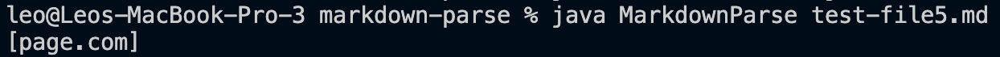

# CSE15L Lab Report 2
## Change 1
Note: Change 1 and Change 2 are in the same commit (dealt with different bugs)

Note: The change for this specific error is at line 13.
[Fail Inducing File 1](TestFiles/test1.md)
* Error message:

Explanation:
After the last paranthesis, there is a space. This causes the algorithm in getLinks() to run an infinite loop. Since after the last paranthesis the string has not ended, the program continue to search for other brackets, which there are none, so the index is updated to -1. The indexOf() method seems to not recognize negative arguments as an exception, therefore continue to loop through the file over and over, causing an outOfMemoryException. The change of this commit corrects the while loop in searching if there exist another "[" after the currentIndex, ensuring that there is no further loops if there are no more links after currentIndex.

## Change 2

Note: the change for this error is from line 15 to 27.
[Fail Inducing File 2](TestFiles/new-test.md)
* Error message:

Explanation:
This specific bug doesn't cause any exceptions as symptom. However, in the fail inducing file, there is a link and a picture. Both have a format of "[name](path)" except with a "!" before the bracket for the picture. The algorithm recognizes the picture as a link so therefore prints the path of the picture aswell. The change checkes if "!" is right before the "[" detected, therefore avoids printing paths of pictures.

## Change 3

[Fail Inducing File 3](test-file5.md)
* Error message:

Explanation:
This test file contains a "[]" followed by a paragraph and then a "()", which is not a correct syntax for links. The link must be immediatly after the closed bracket. This message is produced since the program doesn't check for materials between the close bracket and open paranthesis. The newly added change checks for if the "(" is immediately after the "]".
