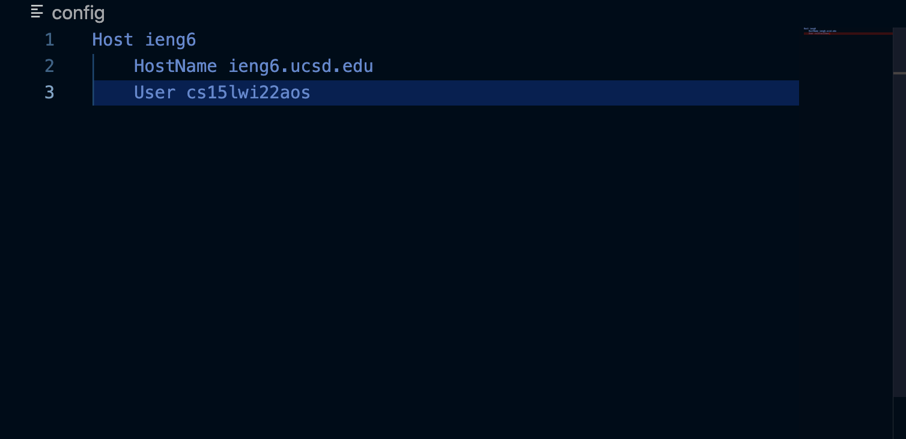
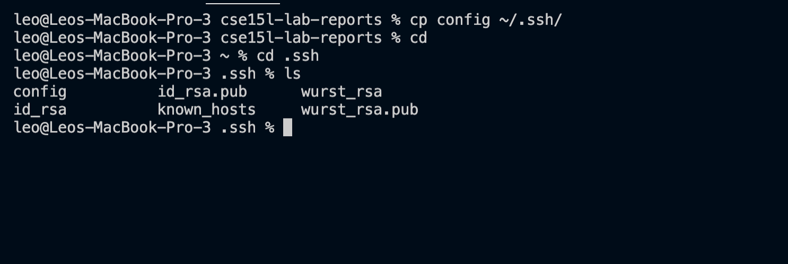
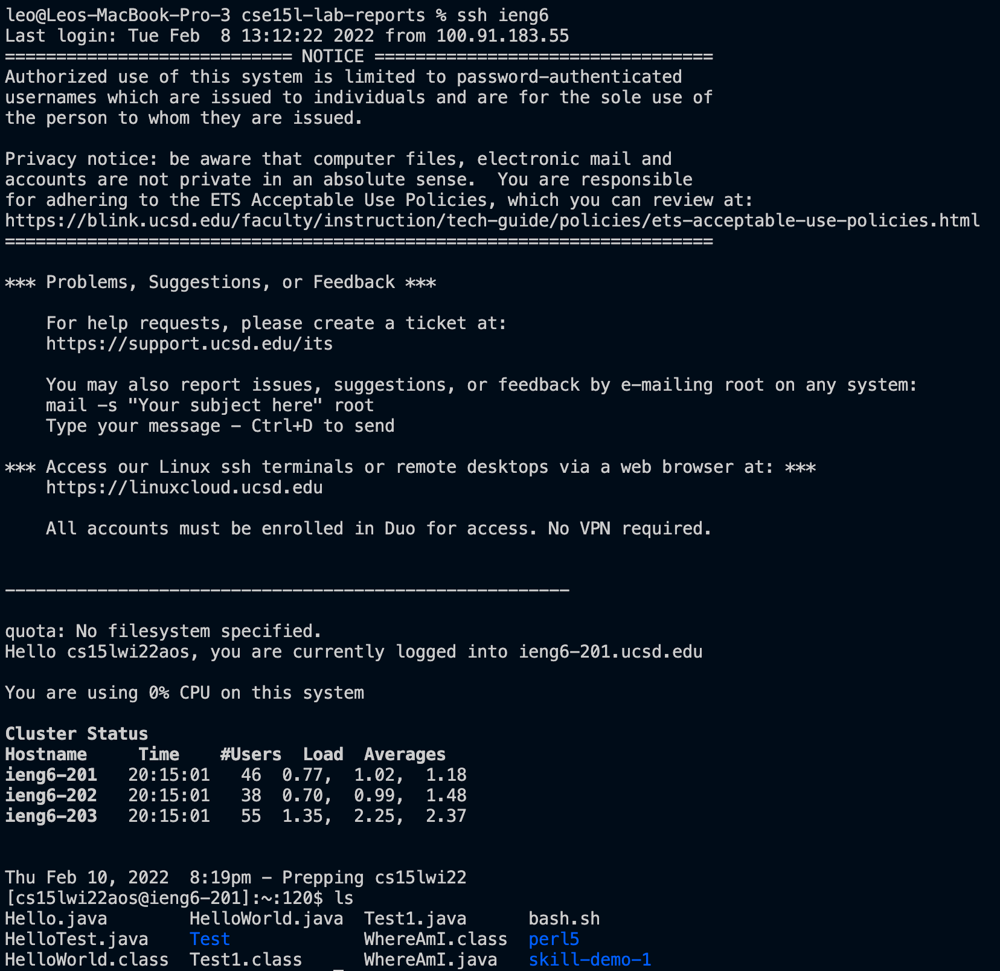
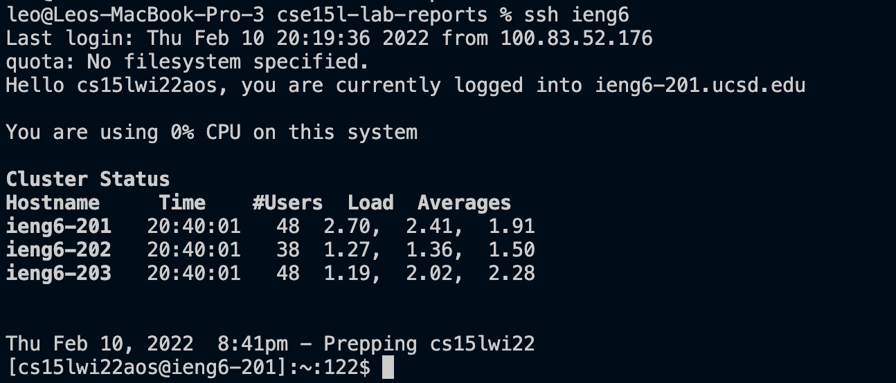
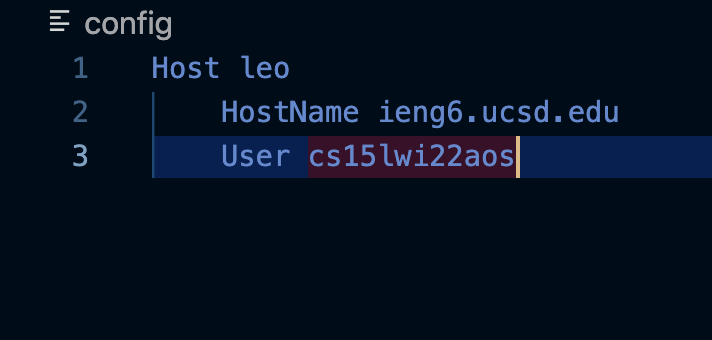
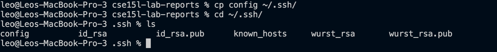
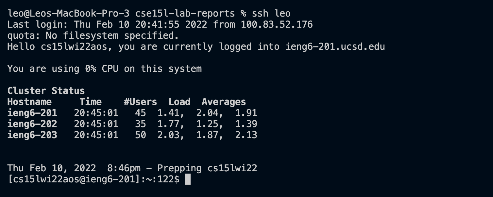
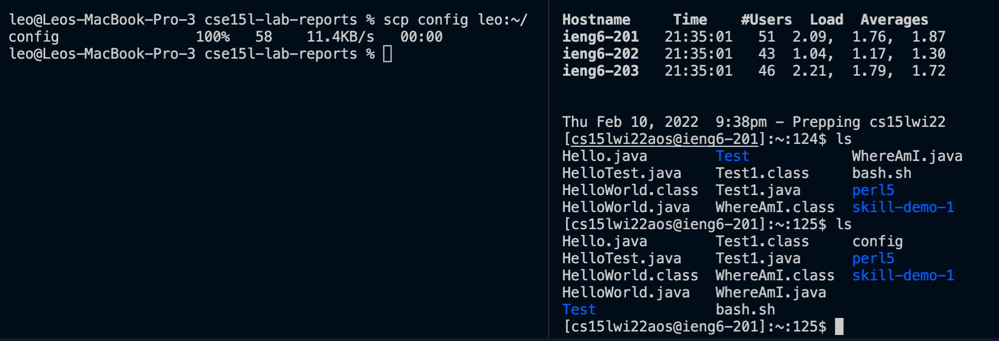

# CSE15L Lab Report 3

## Streamlining ssh Configuration (Choice #1)

## Step 1
Create the config file in VSCode like the picture shown below:
(Created in the same directory as this lab report repository)
The host is specified as 'ieng6'

## Step 2
Copy the config file to User/.ssh/ using `cd config ~/.ssh/`
As shown in the picture below, once changed into the .ssh
directory, listing the files show that config is there.

## Step 3
Now ssh into the class-specific account using
`ssh ieng6` yielded the following:

The command successfully connected to the secure shell.
One interesting note is that it provided the last login
time but showed alerts I assumed to only pop-up during
the first login. The second time I logged in using
the same command did not show these alerts:

## Step 4
Now I would like to use a name other than ieng6, so I changed 
the config file and set the name to leo.

Again, copy the file over to .ssh using the cp command and 
it should be updated. Now `ssh leo` should work instead of 
`ssh ieng6`.

Running the command:

We can see that the command is succfully ran as config has 
been updated.

## Step 5
Now I should be able to scp files using `ssh <file> leo`:

First ssh into the course-specific account, after listing
we can see that config does not yet exist in the main directory
after `scp config leo:~/` has been executed (since config is in
my current directory), ls in the ssh console shows that config is
now in the main directory, hence the command successfully used
the `leo` in place of the hostname and user.