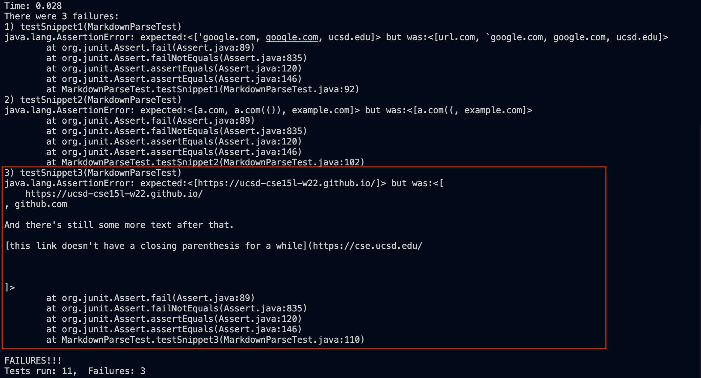

# CSE15L Lab Report 4

Repoistories used:

Personal: [markdown-parse](https://github.com/xis004/markdown-parse)

Reviewed: [markdown-parse](https://github.com/littlefishy1/markdown-parse) 
(commit: cdc2dd2f682f6341f9131352bb39a9a487af1457)

### Snippet #1
```
`[a link`](url.com)

[another link](`google.com)`

[`cod[e`](google.com)

[`code]`](ucsd.edu)
```
(Copied from [Week 8 lab guide](https://ucsd-cse15l-w22.github.io/week/week8/))

##### Determining the output
Based on [CommonMark](https://spec.commonmark.org/dingus/), MarkdownParse should return the following ArrayList:
["'google.com", "google.com", "ucsd.edu"]

##### Implementation of test
The implementation of the test looks like the following:

First call getLinks on snippet1, which stores the content of snippet1, and store into an ArrayList called res (short for result).
Next, create an ArrayList called exp (short for expect), and add all expected links to exp.
Last, assert if exp and res are the same.

Note: The tests are the same on both implementations except added filepath and String conversion within the test on the reviewed version (rather than doing so in setup method).

#### Personal Implementation

The test failed. It did not correctly identify that "url.[]()com" is an invalid link and also did not add "ucsd.[]()edu" to the list.

#### Reviewed Implementation

The test failed. It did not correctly identify that "url.[]()com" is an invalid link.

### Snippet #2
```
[a [nested link](a.com)](b.com)

[a nested parenthesized url](a.com(()))

[some escaped \[ brackets \]](example.com)
```
(Copied from [Week 8 lab guide](https://ucsd-cse15l-w22.github.io/week/week8/))

##### Determining the output
Based on [CommonMark](https://spec.commonmark.org/dingus/), MarkdownParse should return the following ArrayList:
["a.[]()com", "a.[]()com(())", "example.[]()com"]

##### Implementation of test
The implementation of the test looks like the following:

Similar to testSnippet1, testSnippet2 creates ArrayLists res and exp to store the result of getLinks(snippet2) and the expected ArrayList.

#### Personal Implementation

The test failed. It did not correctly identify "a.[]()com(())" but falsely found "a.[]()com((". It also did not find "example.[]()com" as a valid link.

#### Reviewed Implementation

The test failed. It did not find "a.[]()com" and it did not correctly identify "a.[]()com(())" but falsely found "a.[]()com((".

### Snippet #3
```
[this title text is really long and takes up more than 
one line

and has some line breaks](
    https://www.twitter.com
)

[this title text is really long and takes up more than 
one line](
    https://ucsd-cse15l-w22.github.io/
)


[this link doesn't have a closing parenthesis](github.com

And there's still some more text after that.

[this link doesn't have a closing parenthesis for a while](https://cse.ucsd.edu/


)

And then there's more text
```
(Copied from [Week 8 lab guide](https://ucsd-cse15l-w22.github.io/week/week8/))

##### Determining the output
Based on [CommonMark](https://spec.commonmark.org/dingus/), MarkdownParse should return the following ArrayList:
["https:/[]()/ucsd-cse15l-w22.github.io/"]

##### Implementation of test

Similar to testSnippet1, testSnippet3 creates ArrayLists res and exp to store the result of getLinks(snippet3) and the expected ArrayList.

#### Personal Implementation

The test failed. In addition to adding "https:/[]()/ucsd-cse15l-w22.github.io/" to the result, it also added other invalid links (along with texts) to the ArrayList.

#### Reviewed Implementation

The test failed. Similar to the personal implementation, in addition to adding "https:/[]()/ucsd-cse15l-w22.github.io/" to the result, it also added other invalid links (along with texts) to the ArrayList.

### Questions
1. Since in my implementation of MarkdownParse I did not consider the case of code blocks within links, there are many lines that I would need to add inorder to achieve this. However, there could be some potential easy fixes for certain formats such as checking the start and end of code blocks and whether it contains "[", "]", "(", or ")" in there, but based on the outputs of [CommonMark](https://spec.commonmark.org/dingus/), it is not always the case that code blocks take precedent over links. (e.g. ``"[another link](`google.com)`"``)
2. Personally, I haven't found any easy fixes to nested brackets or parantheses within links. It is hard to check whether which bracket or parenthesis ends the link (Like this case: `[aLink[]name()[]))](random.com)`). Any addition in attempt to fix this implementation (using my ideas) would easily take over 10 lines.
3. I believe snippet 3 has the easiest problem of all. After a little testing, I found that links would become invalid with more than 1 line breaks before or after the link. We only need to check if there are more than 1 line breakes before or after the link to see if the link is invalid. Moreover, there cannot be line breaks within the name of the link (i.e. the content between the brackets). Hence after checking these cases, the symptoms generated by testSnippet3 should be resolved.