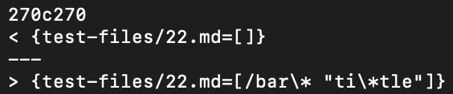
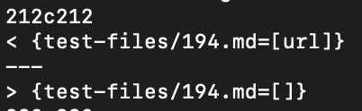

# CSE15L Lab Report 5

## Inconsistencies 

To find inconsistencies between the two algorithm, I modified the output format of my own MarkdownParse to match the provided algorithm's format (i.e. changed the output from [*links here*] to {*file path*=[*links here*]}). Then, I used the `diff` command to check the inconsistencies between the outputs of the two algorithms. The following are three inconsistencies I found using this method.

### 22.[]()md
22.[]()md looks like the following:
`[foo](/bar\* "ti\*tle")`

The expected output should be `[bar*]` according to [CommonMark](https://spec.commonmark.org/dingus/) and [Markdown Preview Enhanced](https://marketplace.visualstudio.com/items?itemName=shd101wyy.markdown-preview-enhanced) on VSCode.

The difference between the outputs of each MarkdownParse.java is the following:


As we can see, neither algorithm provided the correct link. My output (the bottom line), provided the entire string inside the parenthesis. My program cannot recognize this format of link and hence cannot provide the correct link here. It would simply take the entire string inside the detected link format `[link name](link)` and provide the string inside the parenthesis.

### 194.[]()md
194.[]()md looks like the following:
```
[Foo*bar\]]:my_(url) 'title (with parens)'

[Foo*bar\]]
```

The expected output should be `[my_(url)]` according to [CommonMark](https://spec.commonmark.org/dingus/) and [Markdown Preview Enhanced](https://marketplace.visualstudio.com/items?itemName=shd101wyy.markdown-preview-enhanced) on VSCode.

The difference between the outputs of each MarkdownParse.java is the following:


Again, neither algorithm provided the corret result. My output (the bottom line), did not produce a link at all. My algorithm checks for whether there exists a "]" that is immediately followed by a "(". In this file, there is no substring "](", hence my code does not recognize any links in this file. This file is also using a format that is not recognized by my algorithm.